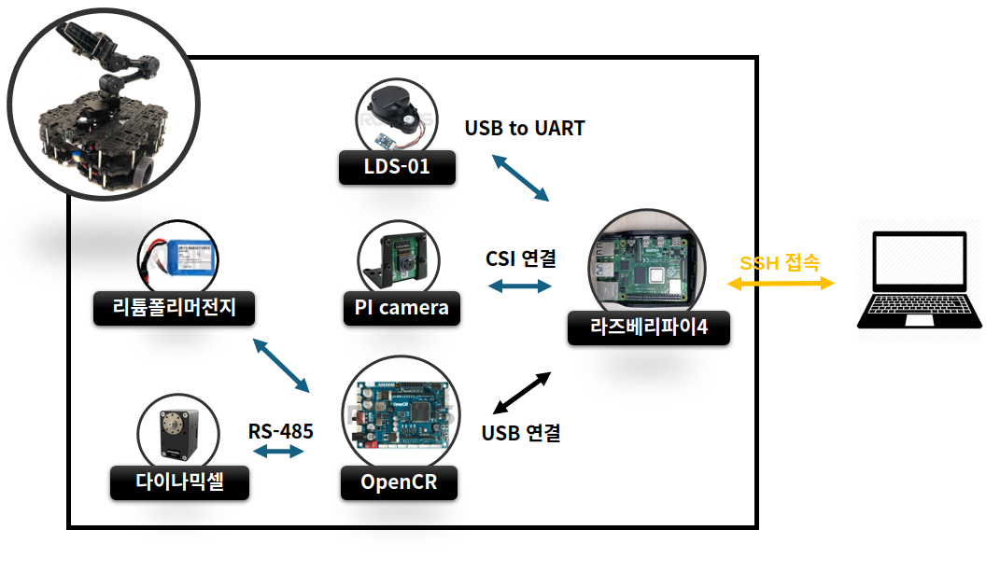
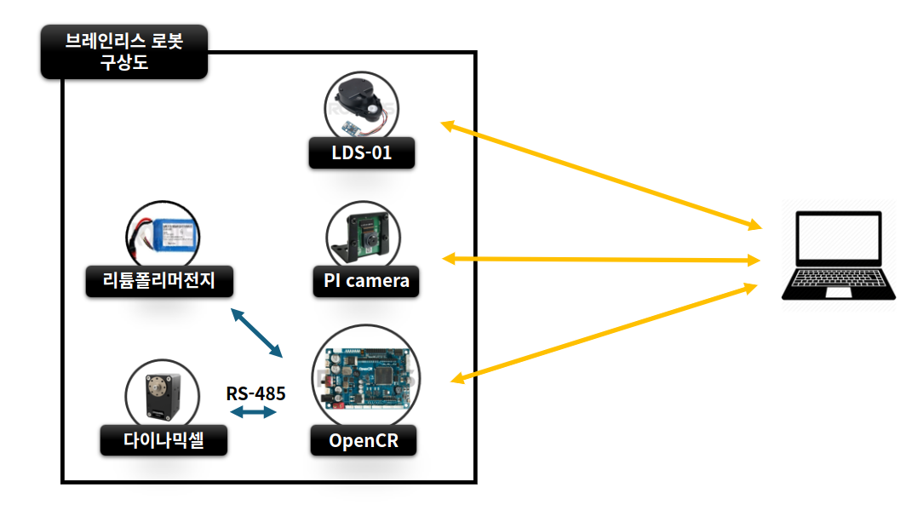

# Remake Mobile Robot by ROS2

## 상태
* 진행 : 완료
* 기간 : 2023-10-6 ~ 2023-11-19
* 인원 : 1명
* 결과
    * 라이다 SW구현

        

    * 카메라 SW구현

        

    * 모터제어 SW구현

        

    * 완성

        

    * 브레인리스 로봇 구현을 위해, SBC 없이 같은 기능 구현

        

## 개요
* 로보티즈의 터틀봇3를 분해하여 구조와 작동원리를 이해하고, 같은기능(S/W)을 직접 구현함

## 개발 의의
> 지금까지 여러 로봇을 사용해 보았지만, 작동원리를 이해하고 다룬 것이 아님을 인지함. 진정한 발전을 위해서는 로봇의 작동원리에 대한 이해가 필요함.
* 1 단계 : 메이저한 로봇회사의 완제품 로봇을 분해하여 구조를 파악
* 2 단계 : 각 부품을 작동시키는 S/W 를 직접 구현(다소 기능이 떨어지더라도)
* 3 단계 : 브레인리스 로봇 구현을 위해, SBC 제거 후, 같은 기능 구현

## 구조

## 환경
* 관제
    * **OS** : Ubuntu 20.04
    * **미들웨어** : ROS2 Foxy
    * **언어** : C, C++, python
    * **네트워크** : Wi-Fi

* 로봇
    * **OS** : Ubuntu 20.04 server
    * **미들웨어** : ROS2 Foxy
    * **언어** : C, C++, python
    * **네트워크** : Wi-Fi
    * **H/W**
        * SBC : 라즈베리파이4
        * MCU : OpenCR
        * 라이다 : LDS-01
        * 카메라 : PI Camera
        * Actuator : 다이나믹셀(서보 모터)

